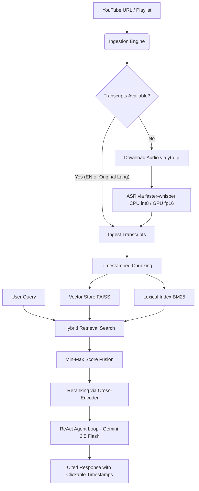

# 🎬 Agentic Multi-Video Research Assistant

An advanced, production-grade agentic research application designed to ingest, transcribe, index, search, and analyze multiple YouTube videos or entire playlists simultaneously. Backed by a hybrid dense-sparse RAG pipeline, local Cross-Encoder reranking, and a conversational ReAct agent loop powered by Google's Gemini 2.5 Flash.

---

## 📖 Overview

The **Agentic Multi-Video Research Assistant** provides researchers, students, and content creators with an automated platform to query and compare video transcripts. By combining vector semantic search (FAISS) with lexical keyword matching (BM25), the application ensures robust query retrieval. In cases where videos lack pre-existing subtitles, the engine automatically extracts the audio and transcribes it using local speech-to-text model optimization (OpenAI Whisper).

---

## 🏗️ Architecture & Technical Pipeline

The flowchart below represents the data ingestion, RAG retrieval, and agent reasoning pipelines:



1. **Ingestion Engine:** Fetches metadata using `yt-dlp` and checks for manual or auto-generated transcripts (English or original language) using `youtube-transcript-api`.
2. **ASR Fallback:** If captions are disabled, it downloads the audio track and transcribes it locally using `faster-whisper`. CUDA GPU is automatically utilized with `float16` precision if available; otherwise, CPU is used with `int8` quantization.
3. **Semantic Chunking:** Groups segments into overlapping chunks keeping track of start/end timestamps.
4. **Hybrid Indexing:** Feeds chunks to `models/gemini-embedding-001` to construct a dense vector FAISS index, and tokenizes text to build a sparse lexical BM25 index.
5. **Hybrid Retrieval:** Blends FAISS and BM25 scores using min-max scaling with a custom `alpha` factor.
6. **Cross-Encoder Reranking:** Re-evaluates retrieval candidates using the local `ms-marco-MiniLM-L-6-v2` cross-encoder to select the top 5 most relevant grounding passages.
7. **ReAct Agent Loop:** A conversational agent loop (`VideoResearchAgent`) executing in-context tool calls (`search_videos`, `get_video_details`, `summarize_video`) to retrieve facts, verify details, or summarize content.
8. **Cited Answers:** Emits responses using clickable format: `[Video Title - MM:SS]`, which links directly to the corresponding YouTube timestamp.

---

## 🌟 Core Features

* **Multilingual Transcript Retrieval:** Automatically prioritizes manual English captions, auto-generated English, manual original-language, and auto original-language transcripts.
* **ASR Speech-to-Text Fallback:** Direct speech-to-text fallback with local execution parameters displayed in the System Information sidebar.
* **Typing Stream chat:** Aligned chat layouts with copy, feedback (like/dislike), and answer regeneration buttons.
* **Side-by-Side Video Comparison:** Generate comparison tables grounding claims across transcripts of multiple selected videos.
* **Summaries and Interactive Quiz Room:** Inspect metadata details and generate bulleted summaries. Challenge yourself with a dynamically generated 5-question multiple-choice quiz (grounded in transcripts) for Easy, Medium, or Hard difficulty.
* **RAGAS Evaluation Dashboard:** Run real-time RAGAS evaluations (Faithfulness, Relevancy, Context Precision) using Gemini 2.5 Flash and track history in a visual dashboard trend chart.
* **Execution Trace (Debug Mode):** Toggle debug mode to reveal intermediate steps (thoughts, tool arguments, latency, dense/sparse/rerank scores).

---

## 🛠️ Tech Stack

* **Front-end UI:** Streamlit (with custom premium light-mode CSS)
* **AI Orchestration & Agents:** LangChain Core, Google GenAI SDK (Gemini 2.5 Flash)
* **Embeddings:** Gemini API (`models/gemini-embedding-001`)
* **Vector Indexing:** FAISS CPU
* **Lexical Indexing:** Rank-BM25
* **Reranking:** Sentence-Transformers (Cross-Encoder `ms-marco-MiniLM-L-6-v2`)
* **ASR Transcriptions:** faster-whisper, PyTorch, imageio-ffmpeg
* **Scraping & Subtitles:** yt-dlp, youtube-transcript-api
* **Evaluation:** Ragas, HuggingFace Datasets

---

## 🚀 Installation & Setup

### Prerequisites
- Python 3.10+
- **FFmpeg:** Required for audio extraction during ASR fallback.
  - *Windows:* Install via Chocolatey (`choco install ffmpeg`) or download static binaries and add to system PATH.
  - *macOS:* `brew install ffmpeg`
  - *Linux:* `sudo apt-get install ffmpeg`

### Step 1: Clone and Enter the Project Directory
```bash
git clone <repository_url>
cd agentic-video-research
```

### Step 2: Set Up a Virtual Environment
```bash
python -m venv .venv
# Activate on Windows (cmd)
.venv\Scripts\activate
# Activate on Windows (PowerShell)
& .venv/Scripts/Activate.ps1
# Activate on macOS/Linux
source .venv/bin/activate
```

### Step 3: Install Dependencies
```bash
pip install --upgrade pip
pip install -r requirements.txt
```

### Step 4: Configure Environment Variables
Create a `.env` file at the root of the project:
```env
GOOGLE_API_KEY=your_gemini_api_key_here
WHISPER_ASR_MODEL=base
```
*Note: If no Google API key is supplied, the application will run in simulated demo mode with fallback static responses.*

---

## 💻 Usage

### Launching the Streamlit Web Application
Ensure your virtual environment is active:
```bash
streamlit run app.py
```
Open `http://localhost:8501` in your browser.

### Running CLI Verification Scripts
Verify the ingestion and fallback pipelines:
```bash
# Verify transcript fetch priority and ASR fallback
python ../test_fallback.py

# Verify indexing and retrieval
python test_retrieval.py --url "https://www.youtube.com/watch?v=ySEx_BqVx8A" --query "what is an API"

# Verify answer generation and Ragas evaluation
python test_generation.py

# Verify agentic ReAct loop and tool calls
python test_agent.py
```

---

## 🔮 Future Work

* **Multi-Modal Video Ingestion:** Supplement transcripts with visual analysis by extracting keyframes and running them through Gemini Vision models.
* **Distributed Vector Store:** Replace local FAISS indexes with managed cloud vector databases (e.g. Pinecone, Qdrant) for high-scale multi-user production loads.
* **Async Ingestion Pipeline:** Run ingestion tasks asynchronously using Celery and Redis to prevent blocking the Streamlit UI thread during long ASR transcription runs.
